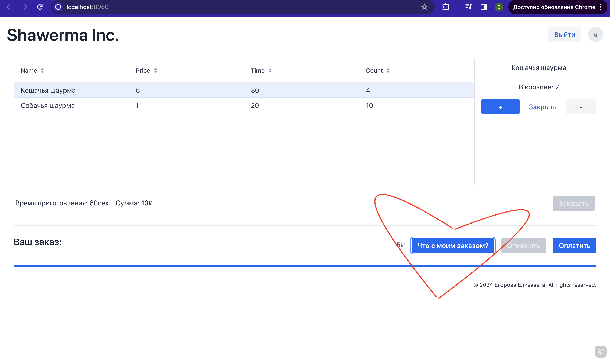

# Shawerma

Это проект ресторана, выполненый в рамках ДЗ2

## Проект
В проекте реализована backend, а также frontend составляющая, реализованные с помощью фреймворка Vaadin

## Интерфейс

Так как в приложении есть веб часть, то интерфейс визуально прост и понятен. ВАЖНОЕ УТОЧНЕНИЕ: чтобы просметреть статус заказа, нужно воспользоваться специальной кнопкой, находящейся рядом с оплатой и отменой заказа


## Запуск

для запуска введите команду
```
./mvnw
```

## Функционал

1) В программе реализована система регистрации и проверки соответсвия личных данных
2) Реализована часть spring Boot
3) Есть многопоточная обработка заказов
4) Также вы можете оплатить заказ банковской картой или оплатить с помощью кнопки "У меня нет карты"
5) У администратора есть функции, позволяющие настраивать всю работу ресторана, а также просматривать выручку работы
6) Заказ можно отменить или добавить в него новые позиции
7) Можно регестрировать новых пользователей
8) Изначально есть 2 пользователя c соответствующим функционалом:
   1) Login: user / Password: user
   2) Login: admin / Password: admin
   

## Если хотим запустить с Docker

Чтобы запустить приложение с контейнером Docker

```
mvn clean package -Pproduction
docker build . -t my-app:latest
```

Чтобы локально протестировать в сети, запустим докер контейнер

```
docker run -p 8080:8080 my-app:latest
```
